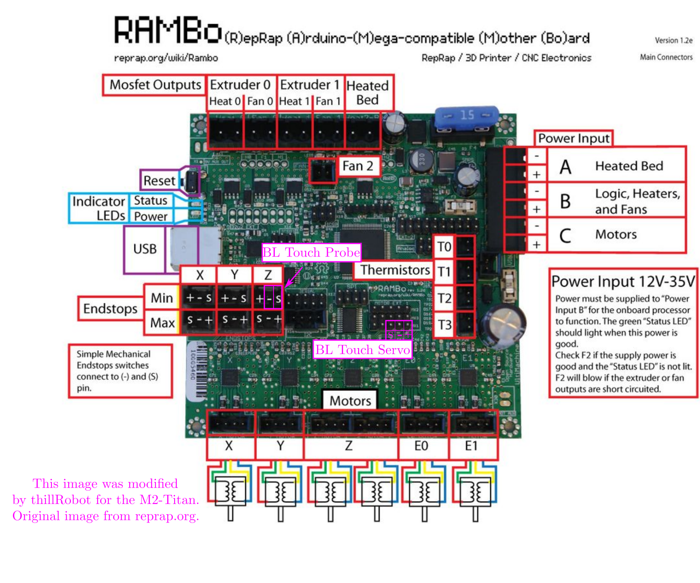

# Marlin
This is a custom configured version of the Marlin2 firmware for the MakerGear rebuild 'M2-TWH'.

## MakerGear M2 - Customized 
- Hotend - E3D v6 with titanium heat break
- Extruder - Custom build from $10 amazon special and geared stepper
- Bed - Heated bed for MakerGear M2 with picture frame glass
- Adhesion - Painters Tape / Polyamide Tape / Build Surface

## Installing/Updating Firmware on the Marlin M2-TWH Printer

### Install Arduino IDE 
The Arduino version must be >= 1.8.8 based on the instructions on the [Marlin Github](https://github.com/thillRobot/marlin_m2/tree/master/Marlin-2.0.m2)

Version 1.8.10 in my `Dropbox/threedee_printing` directory as an executable

The `U8glib` arduino library is needed. This can be installed through the arudino IDE by clicking `Sketch>Include Library>Manage Libraries`

Alternatively, use `arduino-cli` to compile and upload (https://github.com/arduino/arduino-cli)

## Replacing Nozzle on Marlin M2-TWH Printer

Follow the assembly instructions for assembling the E3D V6 Hotend [here](https://e3d-online.dozuki.com/Guide/V6+Assembly/6). Read the instructions, but you are looking for the *hot tightening* procedure.

The *hot tightening* procedure requires the nozzle to be set to 285 which is outside of the normal/safe range of temps for the hotend. The max nozzle temp must be temporarily set to 285 for the mozzle to be replaced. Make sure to reset the limit to a safe xyz after installing a nozzle.

**Note:** A large adjustable wrench will change the temperature of the hotend very quickly and often trigger reset if you are not quick.

## G Code 

### UBL Start - this orginally came from the marlin website [here](https://marlinfw.org/docs/features/unified_bed_leveling.html#unified-bed-leveling)
### Start Code - Initialize UBL - Generates and Saves New Mesh
```
M502          ; Reset settings to configuration defaults...
;M500         ; ...and Save to EEPROM. Use this on a new install.  
M501          ; Read back in the saved EEPROM.

M190 S65      ; Not required, but having the printer at temperature helps accuracy
M104 S210     ; Not required, but having the printer at temperature helps accuracy

G28           ; Home XYZ.
G29 P1        ; Do automated probing of the bed. ; 
;G29 P2 B T  ; Manual probing of locations. USUALLY NOT NEEDED! 
G29 P3 T      ; Repeat until all mesh points are filled in.

G29 T         ; View the Z compensation values.
G29 S1        ; Save UBL mesh points to EEPROM.
G29 F 10.0    ; Set Fade Height for correction at 10.0 mm.
G29 A         ; Activate the UBL System.
M500          ; Save current setup. WARNING - UBL will be active at power up, before any G28.
```
### Start Code - Print UBL - Tilts Previously Saved Mesh
```
M190 S65      ; Not required, but having the printer at temperature helps accuracy
M104 S2

G28 ; home all axes
G1 Z5 F5000 ; lift nozzle

G29 L1        ; Load the mesh stored in slot 1 (from G29 S1)
G29 J         ; No size specified on the J option tells G29 to probe the specified 3 points and tilt the mesh according to what it finds.
```
### End Code - Home and Cooldown
```
M104 S0 ; turn off temperature
M190 S0; turn off bed
G28 X0  ; home X axis
M84     ; disable motors
```


## PID Tuning for Hotend

## PID Tuning for Bed


## Extruder Tuning - algorithm from ALL3DP (https://all3dp.com/2/extruder-calibration-6-easy-steps-2/)

Step 1 - Load filament in printer and nozzle
Step 2 - Mark filament with marker 120mm from extruder inlet
Step 3 - Connect to printer, send `G1 E100 F100`, this should extrude 100 mm of filament
Step 4 - Measure length to mark, this should be 20 mm
Step 5 - Calculate corrected STEPS_PER_UNIT using following equations

    120 - [length to mark] = [actual length extruded]
    [steps/mm value] *100= [steps taken]
    [steps taken]/[actual length extruded]=[accurate steps/mm value]


## Things to do:

- [ ] work on this repo, good documentation will improve printing success
- [ ] re-tuned hotend PID since I have replaced the steel heatbreak with the titanium one
- [ ] learn how to save prusaslicer settings for export, the printer settings specifically
- [ ] convert this repo to a fork of Marlin2, learn about forking
- [ ] update 'big-printer' firmware and move from old repo to new branch 'big-2.0.x' or similar of this repo 
- [ ] install and configure second titan aero extruder hotend combo for dual extrusion 


### compiling and uploading Marlin with `arduino-cli`

Install library for LCD display
```
arduino-cli lib install u8glib
```

Compile the sketch - On the Rasp Pi 3 this takes a long time, maybe 15 minutes or so
``` 
arduino-cli compile --fqbn "arduino:avr:mega:cpu=atmega2560" Marlin.ino 
```

Upload the sketch to the printer MCU - This should not take long
```
arduino-cli upload -p /dev/ttyACM0 --fqbn "arduino:avr:mega:cpu=atmega2560" Marlin.ino 
```


## BL Touch as Z stop Wiring - This needs documentation

The BL Touch sensor can replace the Z min end stop. The probe wires (white and black) from the BL Touch go to the Z min endstop in this confguration. The MOTOR EXT 1 -MX1 on the RAMBo is used to drive the motion of the probe (servo). Make sure to check the wiring and polarity carefully. I had to switch the brown and red wires that came with the BL Touch to match the connection on the RAMBo. 




## Octoprint Server #1 - Old School Way - Manual Install 

### Hardware: Rasp Pi 3 B+

### OS:  Ubuntu 20.04.4 Server - arm64

Download Ubuntu Sever for Rasp Pi https://ubuntu.com/download/raspberry-pi -> "ubuntu-20.04.4-preinstalled-server-arm64+raspi.img.xz"

Flash SD card for rasp pi (16 GB) using 'pi imager' or other.

boot pi and update

default user: ubuntu , psw: ubuntu

add user named pi (or something else)

follow instructions from OctoPrint.org (https://community.octoprint.org/t/setting-up-octoprint-on-a-raspberry-pi-running-raspbian-or-raspberry-pi-os/2337)

### update
```
sudo apt update
sudo apt upgrade 
```
###  install dependencies
```
sudo apt install python3-pip python3-dev python3-setuptools python3-venv git libyaml-dev build-essential
mkdir OctoPrint && cd OctoPrint
```
### setup and start virtual environment
```
python3 -m venv venv
source venv/bin/activate
```

### add user pi to dialout and tty groups
```
sudo usermod -a -G tty pi
sudo usermod -a -G dialout pi
```
### test the server for the first time
```
~/OctoPrint/venv/bin/octoprint serve
```

### download scripts to enable automatic startup
```
wget https://github.com/OctoPrint/OctoPrint/raw/master/scripts/octoprint.service && sudo mv octoprint.service /etc/systemd/system/octoprint.service

sudo systemctl enable octoprint.service
```

### start, stop, or restart the service

start Octoprint service:

```
sudo service octoprint {start|stop|restart}
```

### open web interface, 
```
//<IP-of-Pi>:5000
```

### setup webcam streaming with `mjpg-streamer`

I tried using the mjpg-streamer that comes with the snap store, but most of the information I found referred to the one on github instead (https://github.com/jacksonliam/mjpg-streamer). I switched to this and it worked fine.

I did not follow the directions from octoprint exactly, instead I used the basic compile instructions from the mjpg-streamer github

```
sudo apt update 
sudo apt install ffmpeg
sudo apt-get install cmake libjpeg8-dev
sudo apt-get install gcc g++
```

```
git clone https://github.com/jacksonliam/mjpg-streamer.git
cd mjpg-streamer/mjpg-streamer-experimental
```

```
cd mjpg-streamer-experimental
make
```

Next the instructions say to use `sudo make install`, but I have not done this yet.


Start the stream with the following command. Without `sudo` there is a permission denied error.
```
sudo ./mjpg_streamer -i "./input_uvc.so" -o "./output_http.so"
```

You can see the stream in a browswer at `https://<IP-of-Pi>:8080/?action=stream`, and this URL needs to set in the Octoprint Settings

OctoPrint Settings -> Webcam and Timelapse
```
Stream URL: http://<IP-of-Pi>:8080/?action=stream
Stream aspect ratio: 16:9
Enable timekapse support: checked
Snapshot URL: http://127.0.0.1:8080/?action=snapshot
Path to FFMPEG: /usr/bin/ffmpeg
Enable OctoPrint watermark in timelapse movies
```

## Octoprint on Docker 
Lol, this was a lot easier than the other way. 


